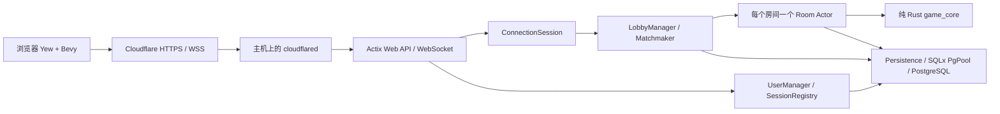

# Patchwork 房间、匹配与对战方案

更新：2026-09-13。工程基础、PostgreSQL 数据层、身份会话、好友房、断线恢复、完整规则与权威事务、Bevy 联机棋盘及 T40 双浏览器完整对局验收已完成。FIFO 匹配暂缓。Windows 数据库和后端已部署，Cloudflare 与公网前端联调属于阶段 9。阶段进度见 [开发 TODO](DEVELOPMENT_TODO.md)，部署实况见 [Windows 部署记录](WINDOWS_DEPLOYMENT.md)。

## 1. 目标和源码基线

在现有 Patchwork 中实现双人好友房间、FIFO 快速匹配、服务器判定的回合对战、断线重连与对局恢复。沿用 rust_game_server 的 `LobbyManager → Room → ConnectionSession` Actor 架构；后端计算和数据存储都位于自有 Windows 主机，Cloudflare 仅提供 HTTPS/WSS 中转。

本次分析基于：

- 当前项目：`D:\documents\git\patch_work`，提交 `f3d45ca0ec1bece7a3996e99a460177eaa722963`。
- 参考项目：`D:\documents\git\rust_game_server`，提交 `7a3b13a08c2a495b10abff4028df7519c6b214c5`。以下路径均相对该仓库，除非注明 Patchwork。
- `src/game/lobby_mgr.rs`：大厅索引、房间 Actor、成员、准备状态、房主、对局实例。
- `src/game/req/lobby/`：建房、入房、离房、准备、开局、房间信息。
- `src/game/client_connection.rs` 与 `pb/envelope.proto`：WebSocket 会话、请求响应关联、服务器推送。

参考项目没有自动匹配队列、评分匹配或跨进程房间协调实现。已有房间代码作为设计参考，不能标记为经过并发、重连和恢复验证的成品。

## 2. 技术结构

### 2.1 后端

本方案选择 Actix Web + Actix，在一个后端进程内运行各 Actor，保持原项目的实现风格。现有 Axum/Shuttle 启动层改为独立 Windows 可执行程序；现有三个鉴权 API 的路径、方法和兼容响应保留，处理逻辑抽成独立模块。无需同时启动 Axum 和 Actix 两套 HTTP 服务。

数据库采用同机独立 **PostgreSQL** 实例，承接用户、房间、对局、事件与战绩；正式数据库名 `patchwork`，业务 schema 为 `patchwork`。Rust 使用 SQLx `PgPool` 异步访问，迁移使用 SQLx migrations。正式集群已在 192.168.5.9 初始化，不复用其他项目的数据库。写入验收使用单独的 `patchwork_test_deploy_*` 数据库。



### 2.2 职责与状态归属

| 模块 | 拥有的状态 | 约束 |
|---|---|---|
| UserManager | 用户资料、持久会话、令牌撤销版本 | 昵称以数据库为准，不能靠旧 JWT 覆盖资料 |
| SessionRegistry | `user_id → session_id / generation / connection` | 一个账号仅一个有效游戏连接；新连接接管，旧连接立即失效 |
| ConnectionSession | 收发、鉴权上下文、心跳、发送队列 | `room_id` 只是缓存；客户端不能指定实际操作者身份 |
| LobbyManager | 房间目录、玩家占用索引、匹配票据、成员操作协调 | 所有建房、入房、离房、入队、取消通过这里进入 |
| Matchmaker | 按模式划分的 FIFO 队列 | 第一版作为 LobbyManager 内部模块，避免增加跨 Actor 事务 |
| Room | 有序座位、准备状态、房间阶段、对局版本 | 每房唯一 Actor；串行判定本房命令 |
| game_core | 纯规则与可序列化状态 | 不依赖 Bevy、Yew、Actix、数据库或系统随机数 |
| Persistence | PostgreSQL 事务、迁移、快照、命令回执、事件 | 使用共享 PgPool；数据提交成功后才发成功响应或对局广播 |

LobbyManager 和 PgPool 在 HTTP worker 工厂之外创建一次，各 worker 共享实例。Room 不能因客户端连接或 HTTP worker 数量而重复创建。第一版只运行一个后端实例，由 Windows 全局命名互斥锁防止同机误启第二份程序；数据库约束继续保护唯一占用。PostgreSQL 支持多连接不代表 Actor 已支持多实例部署，跨主机调度和房间所有权租约不在本期范围。

## 3. 原有缺陷与本方案的修复规则

| 问题与来源 | 修复设计 | 必须验证的结果 |
|---|---|---|
| `lobby_mgr.rs:23` 直接取 `users[0]`、`users[1]`，开局无人数校验 | 座位固定为 `[Option<Member>; 2]`；仅恰好两名有效玩家可开局；使用类型化 `TwoPlayers` 转换，不直接索引临时 Vec | 一人准备后点击开局返回 `NOT_ENOUGH_PLAYERS`，无 panic |
| `enter_room.rs:99` 无容量和开局限制 | 只允许 `Waiting` 且有空位的房间加入；重连走独立恢复命令 | 第三人返回 `ROOM_FULL`；对局中陌生人返回 `ROOM_NOT_JOINABLE` |
| 成员与玩家顺序依赖 HashMap | 明确 `seat=0/1` 与单调 `join_seq`；入座、房主、先手分别记录 | 重连、进程恢复后双方座位不交换；房主变更不改变先手 |
| `leave_room.rs:112` 任意迭代选择房主 | Waiting 中房主自愿离房立即转移给剩余成员；断线保留至宽限期结束；重置准备 | 只有一个房主，广播完整成员快照 |
| 仅记录 Ping/Pong，无完整断线和重连流程 | 统一处理 Close、流结束、错误、发送失败、超时；使用连接代次和重连宽限期 | 旧连接断开事件不能踢掉刚重连的新连接 |
| 全局 `user_to_room` 在异步成功后更新，存在并发窗口 | 用每用户操作预留、房间有序变更队列、数据库唯一约束与可查询操作状态 | 同账号多连接并发入两房，最多一个成功 |
| Ready 使用 toggle，重试会反转状态 | 改成 `SetReady { ready: bool }`，带幂等请求 ID；检查有效成员、阶段与版本 | 重发同一个准备请求，结果保持不变 |
| 开始消息排除房主，初始状态不完整 | 所有成员收到相同 `GameStarted` 完整快照；房主另外获得对应请求回执 | 双方确认同一 `game_id`、版本、座位和初始规则状态 |
| 依赖房主结束游戏／转发世界状态 | 服务器验证玩家动作与结果；客户端只发意图；认输是独立命令 | 客户端不能提交任意胜者、分数或覆盖对方棋盘 |
| 畸形消息路径有 unwrap；邮箱／发送队列无明确背压 | 解码返回结构化错误；限定消息大小、速率、有界队列 | 畸形帧和慢客户端只影响本连接，不终止后端 |

表中完整 Actor/API 行为仍按后续阶段实现。阶段 2 已验证数据库容量/唯一占用、事务幂等与回执恢复；不能据此宣称房间协议端到端缺陷全部修复。

## 4. 房间生命周期

阶段使用枚举 `Waiting → Starting → Playing → Finished → Closed`，允许 `Starting` 在事务确定失败后回到 `Waiting`。断线信息与阶段分开记录，不用多个布尔值组合。

- **Waiting**：可入房、准备、离房、改房间设置。成员或规则发生变化，双方准备状态清空；准备必须绑定当前 `room_version`。
- **Starting**：已锁定两名玩家和规则版本，拒绝入房、改设置、重复开局。对局初始快照持久化完成后转 Playing；提交结果不明时查询操作回执，不猜测失败重新创建。
- **Playing**：拒绝新玩家和再次准备；原玩家可以恢复连接。房主只有界面管理含义，不决定动作有效性与胜负。
- **Finished**：结算只提交一次。双方可离房，或显式请求再来一局；两人同意后生成新的 `game_id`，准备与命令作用域重新开始。
- **Closed**：停止 Actor、释放目录与玩家占用；数据库保留历史结果。

第一版不开放观战、进行中替补、多人队伍。房间列表分页返回房间号、人数、阶段、是否有密码、规则版本；不返回密码散列、连接凭据或用户私密字段。

好友房间使用内部 UUID 与独立的可分享短码；短码在数据库中唯一，冲突重试有上限。房间密码通过慢哈希验证，计算放专用阻塞线程；它只控制入房，不能替代玩家身份验证。

## 5. FIFO 双人匹配

第一版为休闲匹配，不承诺技能公平。按 `mode + rules_version` 分队列，每个玩家最多一张有效票据；已在房间、对局或成员变更中的玩家不能入队。

票据字段：`ticket_id, user_id, joined_at, join_seq, connection_generation, status, expires_at`。同时间戳按 `join_seq` 排序。票据状态为 `Queued / Reserved / Matched / Cancelled / Expired`。

配对步骤：

1. 对当前队列取最早的两张有效在线票据，跳过已取消、过期、断线或代次失效者。
2. 在 LobbyManager 同步段预留两名玩家与票据，设置 `operation_id`；后来的取消和入房不能穿透预留。
3. 在一个 PostgreSQL 事务内锁定对应的玩家占用行与两张票据，重新检查资格、创建两座位房间、把唯一占用改为房间、标记票据 Matched、写操作回执。所有涉及多个玩家的事务按 user_id 固定顺序加锁，避免交叉加锁。
4. 提交成功后创建或恢复唯一 Room Actor，发布 `MatchFound`。创建 Actor 失败时按已提交房间重试恢复，不能再把两人分配给别人。
5. 双方在默认 15 秒内确认对局。双方确认相当于对此规则版本 SetReady，自动进入 Starting；超时关闭未开始房间，在线且已确认者以原排队顺序重新入队，未确认者需主动重排。

取消与匹配的先后以提交结果为准：取消先提交则不可能配对；匹配先提交则返回 `ALREADY_MATCHED` 和房间快照，客户端决定是否离开。不能对用户显示取消成功后仍在后台开局。

匹配成功的重发、断线恢复通过票据状态查询返回同一个房间。服务重启时取消尚未配对的旧票据并通知 `SERVER_RESTARTED`，用户重连后重新入队；已经提交的房间必须恢复，不能作为队列票据再次匹配。

日后再加入 MMR 分差与等待放宽策略，不在当前无稳定战绩数据时虚构评分系统。

## 6. Actor 并发与幂等

Actix 的 `ResponseActFuture` 不自动保证跨 await 原子性，不能因为“每房一个 Actor”就省略一致性设计。[Actix 官方说明](https://docs.rs/actix/latest/actix/type.ResponseActFuture.html)

- LobbyManager 对用户和目标房间设置带 ID 的短期变更预留。来自其他连接的冲突操作拒绝或排队；操作完成必须校验同一个 ID，旧回调不能覆盖新状态。
- Room 使用显式 pending mutation 队列。同一房间有未决持久化时，下一个改变状态的命令等待；心跳与传输活动不依赖这条队列。
- 成员变更由 LobbyManager 协调，Room 校验并预留，Persistence 以房间版本和用户唯一占用做条件提交。Room 等待数据库期间不能再反向等待 LobbyManager，避免循环等待。
- PostgreSQL 成功提交是线性化点。然后应用内存状态、发布推送；推送失败不会回滚已提交动作。
- 邮箱超时和数据库响应丢失是“结果未知”。按 `operation_id/request_id` 查询回执并恢复；无法确认时冻结该操作关联的房间/玩家，禁止直接释放预留或重新执行。
- 崩溃后从数据库快照、活动占用和操作回执重建，内存 HashMap 是索引缓存。

每个变更命令带 `request_id` 和 `expected_version`。游戏命令回执唯一键为 `(game_id, user_id, request_id)`，另保存 payload 哈希；重复 ID 同 payload 返回原结果，不同 payload 返回 `REQUEST_ID_CONFLICT`。响应带版本，事件带 `(game_id, seq)`，客户端去重。对局命令先查幂等回执，再检查版本，保证成功命令的重试仍能取回原结果。

## 7. 连接、身份和恢复

### 7.1 HTTP 与 WebSocket

保留：`POST /api/auth/create`、`POST /api/auth/verify`、`PUT /api/auth/nickname`。新增持久会话刷新、`GET /api/me`、`GET /healthz`、`GET /readyz`、`GET /api/ws`。

浏览器原生 WebSocket 不依赖自定义 Authorization 请求头：升级后 5 秒内必须发送第一帧 `Authenticate { access_token }`，验证通过前只允许认证/关闭消息，禁止订阅、匹配和房间操作。JWT 不放 URL，代理、后端日志均不记录认证帧。HTTP API 继续使用 Bearer 请求头。

WebSocket `Origin` 单独校验。生产允许 `https://ckiddo.github.io`，不是带 `/patchwork/` 的页面 URL；开发允许明确的 localhost Origin。跨域 HTTP 方法包含 GET、POST、PUT、OPTIONS。动态 API 使用 `Cache-Control: no-store`。

原前端的 24 小时 JWT 验证失败后会创建新身份，网络失败也可能触发该路径。阶段 3 已修复：新访问令牌默认 15 分钟，持久会话默认 30 天并支持轮换；网络/5xx 保留身份，401 才尝试刷新。数据库仅存恢复凭据散列，同一用户不因访问令牌到期变成新账号，凭据不写入日志。

保留旧 HS256 JWT 验证密钥时，合法且未过期的旧令牌可受控迁入用户表；首次迁入保存唯一用户，已有数据库资料优先。不具备旧密钥时明确安排重新建立访客身份，不能从未验证 token 导入身份。需要跨设备找回的账号体系另行实现，浏览器访客凭据丢失不等于可恢复账号。

### 7.2 心跳与接管

当前实现：每 15 秒应用心跳，45 秒无有效应用输入/Pong 时断线；认证超时默认 5 秒；等待房宽限默认 60 秒、对局累计预算默认 120 秒。恢复策略可配置，心跳与传输上限目前为代码常量；计时仅累积服务健康的观察区间，详见 [断线恢复与背压](CONNECTION_RECOVERY.md)。

新连接通过认证后取得递增 `generation`。每条动作、Disconnect、超时回调均携带 generation；SessionRegistry 与 Room 丢弃旧代次操作。切换连接时清理或栅栏化旧连接队列，不能让旧 socket 的延迟动作在接管后生效。

- Waiting 断线：保留座位至宽限期，清除准备并通知同伴；到期移除并按规则转移房主。
- Playing 断线：每人每局有固定的累计恢复预算，重新连接不重置；预算耗尽、对方仍在线且没有服务器故障标记时，服务器提交弃权结果。
- 双方同时离线：进入暂停恢复；双方恢复则继续。一段固定保留时间（建议 10 分钟）后仍无法恢复，结束为 `Abandoned`，不伪造胜者。
- 服务重启：所有活动对局进入恢复窗口，扣时暂停，给予一致的新恢复宽限；服务器停机时长不算玩家掉线。单人离线判负定时器在另一人也断线时必须重算，避免按定时器触发顺序误判。
- 重连：客户端提交 `game_id + last_seq`，服务器验证成员后补事件；事件已压缩则返回最新全量快照。客户端确认快照版本后才开放输入。

Cloudflare 的网络更新和空闲超时均可能导致 WebSocket 断开，因此重连是正常路径。[Cloudflare 官方说明](https://developers.cloudflare.com/network/websockets/)

## 8. Patchwork 对局规则迁移

当前 Patchwork 的 `src/new_game/game_state.rs` 中，`BoardGame` 同时保存 Bevy Entity 和游戏数据；`put()` 的货币、移动、特殊拼布、纽扣收益仍有 TODO。`can_put()` 使用 `idx > len`，必须改为安全索引或 `idx >= len`；当前只有一份 `patch_occ`，联机双方必须各自维护棋盘。2026-09-13 复核确认，`new_patches()` 已包含 33 块拼布的形状及 `bt/button` 数值，零值只出现在另一个 `Patch::new()` 构造入口；应核对现有数据后版本化，不能视为全部缺失。`src/game.rs` 虽接收 token，但未建立游戏网络资源。时间图版标记、无限纽扣供给与左右棋盘语义见 [游戏逻辑基线](GAME_RULES_BASELINE.md)。

在已有纯 Rust `game_core` 基础类型上继续扩展，具体规则与界面交互见 [完整对局开发方案](GAMEPLAY_IMPLEMENTATION_PLAN.md)：

T34 已完成 [规则数据冻结与版本注册](RULES_DATA.md)。未知规则不能创建/变更房间规则或开局；T38 已允许正式 patchwork_custom_v1 权威开局与动作事务。旧空对局继续按原格式读取，不自动转换。

- `GameSnapshot`：`game_id, rules_version, state_version, players[2], boards[2], patch_supply, marker, time_track, pending_action, result`。
- 每位玩家的资源、时间位置、行动顺序记录、9×9 棋盘分别保存；座位与身份固定绑定。
- 本项目明确采用“时间落后者行动，同格换上一名普通行动者的另一方”；终局计分为剩余纽扣加首次 7×7 的 7 分奖励，不扣空格分。开局先手沿用已持久化的 `first_player_seat`。
- 前端只发送动作意图，例如 `Advance`、`BuyAndPlace { patch_id, x, y, rotation, flipped }`、`PlaceSpecialPatch`、`Resign`。完整规则由版本化规则集定义，具体费用、特殊效果和胜负判据需和游戏规则逐项核对。
- 服务器判定轮到谁、可选择的拼布、费用、变换后格子、边界、重叠、资源变化、时间轨道收益、特殊拼布与结束条件。付费和落子是一个原子动作，非法落子不能先扣费。
- 初始供给顺序由服务器生成并保存实际数组和规则版本，客户端不各自随机；恢复不依赖某版随机数实现。
- 中立指示物初始在唯一 1×2 拼布之前；购买后移到被取走拼布的空槽，从其后跳过空槽选取至多三块剩余拼布。一次时间移动按位置顺序结算纽扣收入和特殊拼布领取，待放特殊拼布处理完才能进入下一普通行动或终局。
- `apply_action(snapshot, command)` 纯函数返回新状态和事件，拒绝非法动作时输入状态保持不变。
- Yew/Bevy 只负责输入、预览与动画；将提交动作发给服务器，收到确认后更新正式状态。双方收到一致的快照版本和状态摘要。

好友房、准备、空对局同步和连接恢复已完成；当前先按 T34–T40 补齐规则与交互并验收完整好友房对战。FIFO 匹配 T30–T33 按用户要求暂缓，不阻塞首版完整对局；广播落子动画不算完整 Patchwork 规则验收。

## 9. 持久化模型

以下逻辑表已由阶段 2 的正式迁移建立并在独立测试库验证，具体实现见 [数据库说明](DATABASE.md)：

| 表 | 核心字段/约束 |
|---|---|
| users | user_id 主键、nickname、created_at、auth_version |
| sessions | session_id、user_id、refresh_hash、expires_at、revoked_at |
| rooms | room_id 主键、code 唯一、mode、phase、owner_id、version、rules_version |
| room_members | `(room_id, seat)` 唯一，seat 仅 0/1；用户与连接恢复信息 |
| player_occupancy | user_id 主键；queue/room/operation 三选一，关联相应记录 |
| matchmaking_tickets | ticket_id、user_id、queue_key、join_seq、status、expires_at |
| games | game_id、room_id、phase、rules_version、state_version、snapshot、result |
| game_events | `(game_id, seq)` 主键，动作与对应事件 |
| command_receipts | scope、user_id、request_id 唯一，payload_hash、结果版本与响应 |
| operation_receipts | operation_id 主键，成员/匹配事务的终态和结果 |
| game_results | game_id 唯一，双方、分数、结束原因；一局只结算一次 |
| _sqlx_migrations | 由 SQLx 管理的迁移版本、校验和与执行记录 |

对局动作事务同时写：版本条件更新快照、追加事件、保存命令回执，结束动作再写唯一结果。短对局第一版每步保存快照，减少重放复杂度。连接句柄、Actor Addr 和原始令牌不能写入数据库。

### 9.1 PostgreSQL 类型、约束与索引

- 主体 ID 使用 `uuid`，时间使用 `timestamptz`；座位使用 `smallint CHECK (seat IN (0,1))`；版本与事件序号使用非负 `bigint`；快照、事件和回执 payload 使用 `jsonb`，散列使用 `bytea`。Rust 明确处理整数转换，前端协议不经 JS Number 丢失 64 位精度。
- 关系、身份、座位和版本保存为独立列，外键、唯一约束与 CHECK 在数据库层执行，不把关系约束全藏在 JSON 中。
- `room_members` 只保存当前占用，唯一 `(room_id, seat)`、`(room_id, user_id)`；结束后历史座位随对局快照保存。`player_occupancy.user_id` 主键，每个用户初始化一行，状态包含 Idle/Queue/Operation/Room；CHECK 保证关联列和状态一致。
- 对 `matchmaking_tickets(user_id)` 建活动状态（Queued/Reserved）的部分唯一索引；按 `(queue_key, join_seq)` 建 Queued 部分索引。其他索引包括 `sessions(user_id)`、`sessions(expires_at)`、可加入房间的分页键、`games(phase, updated_at)` 和 `game_events(game_id, seq)`。
- 查询默认 schema 固定为 `patchwork`，使用受控 search_path 或显式限定名；迁移账号拥有对象，业务账号只有所需表/序列访问权。

### 9.2 事务、连接池和故障处理

初始共享池建议 `min_connections=1`、`max_connections=8`、获取连接超时 3 秒；业务事务建议 `lock_timeout=2s`、`statement_timeout=5s`、`idle_in_transaction_session_timeout=10s`。这些是待压测的应用角色配置，备份与迁移使用独立配置，不能套用短业务超时。连接数不随房间或 WebSocket 数量一比一增长。

- 默认 READ COMMITTED，显式行锁与唯一约束保证不变量。统一顺序为玩家占用行（user_id 升序）、票据行（ticket_id 升序）、房间/对局行；只需要对局行的操作不能之后再反向申请占用锁。
- 操作用户建立时创建 Idle 占用行，已有用户补行用 `INSERT ... ON CONFLICT DO NOTHING`，然后 `SELECT ... FOR UPDATE`。不能靠锁定“不存在的行”阻止并发插入。
- 对局先锁行、查幂等回执并校验版本，事务中更新快照、追加事件和写回执；`UPDATE ... WHERE state_version = expected_version` 检查影响行数。锁内不做网络调用、密码哈希或等待客户端。
- 第一版单匹配器维持 FIFO，锁冲突有限等待后重试本轮，不引入 `SKIP LOCKED` 悄悄跳过较早玩家。将来并行匹配器需要单独定义公平性与分片策略。
- `40001`（序列化失败）和 `40P01`（死锁）确认事务已回滚后，最多重试 3 次并抖动退避，复用请求 ID。COMMIT 响应丢失仍按“结果未知”恢复，不能无条件重试外部副作用。
- 数据库断连或池耗尽时返回可重试的服务错误并撤销就绪状态；不广播未持久化成功的动作。数据库恢复后校验快照/回执再恢复房间处理。
- PostgreSQL 启用正常持久化保证，保持 `fsync=on`、`full_page_writes=on`、`synchronous_commit=on`，业务表不用 UNLOGGED。监控连接池等待、事务时长、锁等待/死锁、数据库磁盘/WAL 和房间恢复耗时。

迁移在部署阶段由独立迁移账号执行，应用启动只校验 schema 兼容性。开发与 CI 使用独立 PostgreSQL 测试数据库；SQLx 编译期查询若启用，元数据仅从开发/测试库生成，不能把其他项目生产库当作测试或编译依赖。[SQLx 官方仓库](https://github.com/transact-rs/sqlx)、[PostgreSQL 锁机制](https://www.postgresql.org/docs/current/explicit-locking.html)

部署目录、备份和恢复流程见 [DEPLOYMENT_PLAN.md](DEPLOYMENT_PLAN.md)。

## 10. 目录与实施顺序

建议新增/调整：

```text
game_core/src/                  纯规则、序列化状态、动作判定、规则测试
util_lib/src/protocol/          共享消息定义（Protobuf + prost，沿用旧项目形式）
backend/src/api/auth/           兼容鉴权 API、持久会话
backend/src/game/lobby_mgr.rs   大厅、全局占用、Matchmaker
backend/src/game/room.rs        房间状态机、持久化串行操作
backend/src/game/session.rs     WebSocket 会话与连接代次
backend/src/game/req/           lobby / match / game 请求处理
backend/src/persistence/        SQLx PgPool、PostgreSQL 事务与恢复
backend/migrations/            数据库迁移
src/network/                   浏览器连接、重试、快照与事件同步
src/ui/                        大厅、匹配状态、房间、重连界面
tools/deploy/                  构建、预检、发布、备份、回滚脚本
```

1. 抽出协议与用户身份；从 Shuttle 改为本地可执行入口，回归原三个 API，修正 CORS、错误分类和日志中的 token 输出。
2. 实现房间状态机与事务、不变量测试，再接 WebSocket；验收好友房和重连。
3. 增加 FIFO 队列、确认超时和取消竞争测试。
4. 提取 game_core、补规则；接入服务端动作与快照，完成双浏览器对局。
5. 部署独立 PostgreSQL 服务与后端，先做本机回环联调及备份恢复演练；最后接 Cloudflare 域名并更新前端部署配置。

按依赖执行的任务清单见 [DEVELOPMENT_TODO.md](DEVELOPMENT_TODO.md)。

## 11. 验收标准

必须自动化的行为测试：

- 单人、第三人、重复开局、未准备、过期准备版本、对局中入房均返回确定错误，无 panic。
- 同用户两个会话并发入两房；两人抢最后一个座位；入房与匹配并发；取消与匹配并发，数据库与内存占用均一致。
- 同命令重复发送、提交后丢响应再重发、同 ID 不同 payload，不重复扣费/落子/结算。
- 等待房/游戏中断线、旧连接迟到、双人掉线、确认超时、服务器重启，恢复座位和版本正确。
- 数据提交后、推送前注入崩溃；恢复后返回原回执与快照，不能创建重复对局。
- 索引等于 len、越界坐标、旋转/翻转、重叠、资金不足、非本人回合；非法动作完全不改状态。
- 旧三个 HTTP API 的响应兼容；401 与网络故障区分；刷新维持同一用户；昵称 PUT 的浏览器预检通过。
- PostgreSQL 并发事务测试验证唯一约束、锁顺序、超时/死锁重试与提交结果未知的恢复；数据库断连不能导致未提交广播。
- 用 pg_dump/pg_restore 恢复到独立测试库，验证迁移版本、约束、用户与未完成对局；生产备份另做基础备份 + WAL 的指定时间点恢复演练。

真实链路验收：两个独立浏览器身份经正式域名完成匹配和一局对战，模拟断线重连与后端重启；核对两端版本、服务端结果、数据库唯一结果、可执行文件哈希和监听 PID。

建议第一轮容量目标为 100 个并发连接/50 个房间，作为待压测目标而非已证明容量。业务处理 p95、CPU、内存、连接池等待、事务锁等待和恢复耗时分别测量，网络 RTT 另计。

## 12. 参考依据

- 原始架构以第 1 节本地源码与提交为准。
- [Actix 异步处理非自动原子](https://docs.rs/actix/latest/actix/type.ResponseActFuture.html)。
- [Cloudflare WebSocket 连接中断与心跳](https://developers.cloudflare.com/network/websockets/)。
- [PostgreSQL 行锁、事务锁与死锁](https://www.postgresql.org/docs/current/explicit-locking.html)。
- [PostgreSQL pg_dump](https://www.postgresql.org/docs/current/app-pgdump.html) 与 [PITR](https://www.postgresql.org/docs/current/continuous-archiving.html)。
